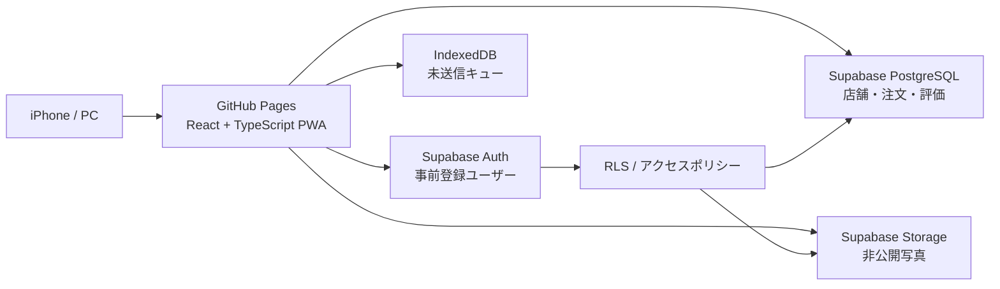
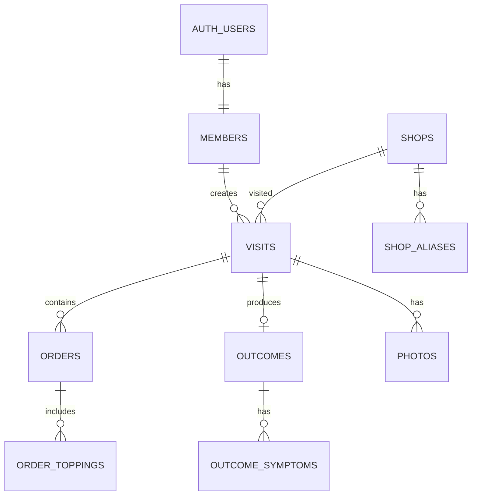

# Jirō Log 設計・実装引き継ぎ書

最終更新: 2026-09-06

この文書は、新しいチャットや別の開発者が、これまでの検討内容を引き継いでJirō Logの設計・実装を開始できるようにまとめたものです。

## 1. プロダクト概要

Jirō Logは、ラーメン二郎・二郎系ラーメンの食事ログを記録し、自分にとって最も満足度の高い注文条件を分析する、少人数向けのWebアプリです。

現在はメモへ手入力しているため、記録の負担が高いことが課題です。最優先する体験は、食後に**写真だけを登録すればログが成立し、コールや評価などを後から追記できること**です。

将来的には、蓄積データから次の注文を提案します。

例:

> 過去に麺200〜249g・微乳化・アブラ通常で胃と脂が適正だった割合が高いため、初回は「小・麺少なめ・アブラ通常」を推奨します。

## 2. 決定済み事項

- React + TypeScriptで実装する。
- Viteで静的ファイルをビルドする。
- GitHub Pagesで公開する。
- Supabaseを認証、PostgreSQL、写真ストレージとして使用する。
- 利用者は身内のみとし、一般向けの新規アカウント登録は提供しない。
- 管理者が利用者を事前登録・招待し、その後Supabase側でも新規登録を無効化する。
- ログインセッションはブラウザに保持し、通常は初回ログイン後に再入力を求めない。
- 写真はSupabase Storageの非公開バケットへ保存する。
- IndexedDBは正式な保存先にはせず、オフライン・通信失敗時の未送信データ待避にのみ使用する。
- スマートフォン、特にiPhone Safariを優先する。
- PWAとしてホーム画面へ追加できるようにする。
- MVPではサービス一般公開、課金、SNS、コメント、いいねは扱わない。

## 3. 成功条件

- 食後、写真だけなら数操作で下書きを作成できる。
- 写真なしの通常ログも2分以内に入力できる。
- 店舗、麺量、乳化度、アブラ、胃・脂キャパなどを自由記述に頼らず集計できる。
- 別の端末でも同じアカウントでログを閲覧できる。
- 利用者以外はログや写真にアクセスできない。
- 既存メモのログを後から移行できる。
- データをCSV等で持ち出せる。

## 4. 全体アーキテクチャ



GitHub Pagesには静的なフロントエンドだけを置きます。DB、認証、写真はSupabase上に置きます。

## 5. 推奨技術スタック

### 必須

- React
- TypeScript
- Vite
- `@supabase/supabase-js`
- React Router

### 導入候補

- React Hook Form: 多項目フォームの管理
- Zod: フォームとデータの検証
- TanStack Query: Supabaseへの取得・更新状態とキャッシュの管理
- Dexie: IndexedDBの未送信キュー
- `vite-plugin-pwa`: manifestとService Worker
- Vitest + Testing Library: 単体・コンポーネントテスト
- Playwright: 主要導線のE2Eテスト

最初からRedux等の大規模なクライアント状態管理は導入しません。サーバーデータはTanStack Query、画面固有の状態はReactの`useState`、フォームはReact Hook Formに分担させます。

## 6. GitHub Pages固有の設計

公開予定URL:

```text
https://nyanmodel.github.io/ai-tools/Jiro-log/
```

Viteでは次のbase pathを設定します。

```ts
base: "/ai-tools/Jiro-log/"
```

GitHub Pagesには任意パスを`index.html`へ戻すサーバー処理がないため、MVPではHash Routerを使用します。

```text
/#/login
/#/visits
/#/visits/new
/#/visits/{id}
```

デプロイはGitHub Actionsで行い、Viteの`dist`をPagesへ公開します。現在のプロジェクトディレクトリは`nyanmodel.github.io`リポジトリ内のサブディレクトリなので、既存サイト全体の公開方法を確認してからワークフローを追加します。

## 7. 認証設計

### 初期セットアップ

1. Supabase Authでメール＋パスワード認証を有効化する。
2. 管理者がSupabase Dashboardから利用者を招待または作成する。
3. 利用者の登録完了後、`Allow new users to sign up`を無効化する。
4. Anonymous Sign-inを無効化する。
5. アプリにはログイン画面だけを置き、新規登録画面を作らない。

### 通常利用

- 初回のみメールアドレスとパスワードでログインする。
- Supabase SDKの`persistSession`と`autoRefreshToken`を利用する。
- 再訪時は保存済みセッションを復元し、直接ホーム画面を表示する。
- ログアウト、パスワード変更、管理者による無効化、ブラウザデータ削除時は再ログインを求める。
- アプリ起動時、Authのユーザーであることに加え、`members`に有効な行があることも確認する。

### 公開クライアントに置けるもの

```text
VITE_SUPABASE_URL
VITE_SUPABASE_PUBLISHABLE_KEY
```

### 絶対に公開しないもの

```text
SUPABASE_SECRET_KEY
service_role相当のキー
```

公開用キーの秘匿ではなく、RLSとStorage Policyでデータを保護します。

## 8. 利用者と権限

現時点の推奨仕様は「メンバー同士で全ログを閲覧でき、通常メンバーは自分のログだけ編集・削除できる」です。

| 操作 | 未ログイン | member | admin |
|---|---:|---:|---:|
| ログ・写真の閲覧 | 不可 | 全メンバー分 | 全メンバー分 |
| ログ作成 | 不可 | 可 | 可 |
| 自分のログ編集・削除 | 不可 | 可 | 可 |
| 他人のログ編集・削除 | 不可 | 不可 | 可 |
| 店舗追加 | 不可 | 可 | 可 |
| 店舗統合・削除 | 不可 | 不可 | 可 |
| メンバー管理 | 不可 | 不可 | 可 |

すべてのログには`created_by`を保持します。将来「自分だけに表示」するモードを加えられるようにします。

## 9. 写真ファーストの登録フロー

### オンライン時

1. ユーザーが「撮影して記録」を押す。
2. `<input type="file" accept="image/*" capture="environment">`でカメラまたは写真ライブラリを開く。
3. クライアントで向き補正を行い、長辺1600px程度へ縮小する。
4. WebPまたはJPEGへ圧縮する。目標は1枚0.3〜0.8MB程度。
5. クライアント側で`visit_id`と`photo_id`のUUIDを生成する。
6. `status = draft`の`visits`行を作る。
7. 写真をStorageへアップロードする。
8. `photos`へメタデータを登録する。
9. 完了画面で「詳細を入力」「あとで」の2択を表示する。

店舗やメニューが空欄でも、写真と訪問日時だけで保存可能にします。

### オフライン・通信失敗時

- 圧縮後画像、UUID、訪問日時、入力済みフォーム値をIndexedDBへ保存する。
- ホーム画面に「未送信」と表示する。
- オンライン復帰時または次回起動時に再送する。
- 同じUUIDとStorage pathを使い、再試行してもログが重複しないようにする。
- アップロード途中で失敗した場合も再試行できる状態を残す。

iOS Safariのバックグラウンド処理だけに依存せず、アプリを再び開いたタイミングで確実に再送します。

## 10. Storage設計

非公開バケット名:

```text
jiro-photos
```

オブジェクトパス:

```text
{created_by}/{visit_id}/{photo_id}.webp
```

方針:

- 非公開バケットにする。
- メンバーのみ閲覧可能にする。
- 通常メンバーは、自分のユーザーIDから始まるパスだけアップロード・更新・削除できる。
- adminは全ファイルを管理できる。
- 一覧では軽量画像を使い、詳細画面でのみ大きい画像を表示する。
- MVPではオリジナル写真を別保存せず、圧縮後の実用画像のみ保存する。

## 11. データモデル



### `members`

| 列 | 型 | 内容 |
|---|---|---|
| `user_id` | uuid PK | `auth.users.id` |
| `display_name` | text | アプリ内表示名 |
| `role` | text | `member` / `admin` |
| `is_active` | boolean | 利用可否 |
| `created_at` | timestamptz | 作成日時 |

### `shops`

| 列 | 型 | 内容 |
|---|---|---|
| `id` | uuid PK | 店舗ID |
| `name` | text | 正式名 |
| `category` | text | `jiro` / `inspired` / `other` |
| `address` | text nullable | 所在地 |
| `is_closed` | boolean | 閉店フラグ |
| `note` | text nullable | 店舗メモ |
| `created_by` | uuid | 登録者 |
| `created_at` | timestamptz | 作成日時 |

### `shop_aliases`

店舗名の表記ゆれ、通称、旧称を保持します。

| 列 | 型 |
|---|---|
| `id` | uuid PK |
| `shop_id` | uuid FK |
| `alias` | text |

### `visits`

1回の来店を表します。写真だけの下書きを正式に許容するため、多くの列をnullableにします。

| 列 | 型 | 内容 |
|---|---|---|
| `id` | uuid PK | クライアント生成可 |
| `created_by` | uuid | 作成者 |
| `shop_id` | uuid nullable | 店舗 |
| `visited_at` | timestamptz | 訪問・撮影日時 |
| `meal_type` | text nullable | 朝食 / 昼食 / ブランチ / 夕食 / 夜食 / その他 |
| `health` | smallint nullable | 1〜5 |
| `hunger` | smallint nullable | 1〜5 |
| `sleep_minutes` | integer nullable | 睡眠時間 |
| `minutes_since_last_meal` | integer nullable | 前回食事からの経過 |
| `pre_meal_note` | text nullable | 食前の食事・飲み物 |
| `exercise_type` | text nullable | 運動種別 |
| `exercise_value` | numeric nullable | 時間・距離等 |
| `status` | text | `draft` / `completed` |
| `note` | text nullable | 自由記述 |
| `created_at` | timestamptz | 作成日時 |
| `updated_at` | timestamptz | 更新日時 |

### `orders`

MVPは1来店1注文でも、将来の複数注文に備えて来店と分離します。

| 列 | 型 | 内容 |
|---|---|---|
| `id` | uuid PK | 注文ID |
| `visit_id` | uuid FK | 来店 |
| `menu_name` | text nullable | メニュー名 |
| `size_label` | text nullable | 小、ミニ、プチ等 |
| `noodle_grams` | integer nullable | 麺量 |
| `noodle_grams_source` | text nullable | `official` / `confirmed` / `estimated` |
| `noodle_adjustment` | text nullable | 通常 / 少なめ / 半分 / 大盛り / その他 |
| `garlic_level` | smallint nullable | ニンニク量 |
| `vegetable_level` | smallint nullable | ヤサイ量 |
| `fat_level` | smallint nullable | アブラ量 |
| `seasoning_level` | smallint nullable | カラメ量 |
| `emulsification` | text nullable | 非乳化 / 微乳化 / 乳化 / 不明 |
| `liquid_fat` | smallint nullable | 液状脂の多さ |
| `pork_count` | numeric nullable | 豚枚数、0.5刻みも許容 |
| `pork_size` | smallint nullable | 豚の大きさ |
| `pork_fattiness` | smallint nullable | 豚の脂身 |
| `pork_note` | text nullable | 豚メモ |

コール量などの段階値は、表示文言ではなく固定数値で保存します。未記録は`NULL`、見たが判断不能の場合は必要に応じて別途`unknown`を表現します。

### `order_toppings`

生卵、うずら、辛味、限定トッピング、「アレ」など可変項目を保持します。

| 列 | 型 |
|---|---|
| `id` | uuid PK |
| `order_id` | uuid FK |
| `name` | text |
| `category` | text nullable |
| `amount_label` | text nullable |

### `outcomes`

| 列 | 型 | 内容 |
|---|---|---|
| `visit_id` | uuid PK/FK | 来店 |
| `taste_score` | smallint nullable | 味 1〜5 |
| `portion_fit` | smallint nullable | 少なすぎ〜多すぎ |
| `stomach_capacity` | smallint nullable | 余裕〜限界 |
| `fat_capacity` | smallint nullable | 余裕〜限界 |
| `post_meal_state` | text nullable | 快適 / 満腹だが快適 / 重い / 気分不良 / その他 |
| `overall_score` | smallint nullable | 総合満足度 1〜5 |
| `next_time_plan` | text nullable | 次回注文方針 |

### `outcome_symptoms`

| 列 | 型 |
|---|---|
| `id` | uuid PK |
| `visit_id` | uuid FK |
| `symptom` | text |
| `note` | text nullable |

症状候補は、なし、胃もたれ、喉の渇き、眠気、胸やけ、気分不良、その他です。「なし」は行を作らない運用でも構いません。

### `photos`

| 列 | 型 |
|---|---|
| `id` | uuid PK |
| `visit_id` | uuid FK |
| `created_by` | uuid |
| `storage_path` | text unique |
| `width` | integer nullable |
| `height` | integer nullable |
| `file_size` | integer nullable |
| `mime_type` | text nullable |
| `captured_at` | timestamptz nullable |
| `sort_order` | integer |
| `created_at` | timestamptz |

## 12. 入力項目

### 最低限の保存

- 写真、または訪問日時
- `status = draft`

### 基本情報

- 店舗
- 訪問日時
- 食事区分
- 食前の食事・飲み物
- 前回食事からの経過時間
- 体調
- 睡眠時間
- 運動
- 空腹度

### 注文情報

- メニュー名
- サイズ表記
- 麺量と情報源
- 麺の増減
- ニンニク、ヤサイ、アブラ、カラメ
- その他コール・トッピング
- スープ乳化度
- 液状脂
- 豚の枚数、大きさ、脂身、メモ

### 食後評価

- 味の満足度
- 麺量の適正度
- 胃キャパ
- 脂キャパ
- 食後状態
- 後遺症
- 総合満足度
- 次回の注文方針
- 自由記述

## 13. 画面設計

### `/login`

- メールアドレス
- パスワード
- ログインボタン
- 新規登録リンクは置かない
- 必要ならパスワード再設定のみ提供

### `/visits` ホーム・履歴

- 最上部に大きな「撮影して記録」ボタン
- 未送信件数
- 詳細未入力の下書き
- 最近のログ
- 店舗、期間、満足度等の検索・絞り込み

### `/visits/new`

- 写真選択を最初に表示
- 写真だけで「あとで入力」が可能
- 基本、注文、食後評価を段階的に表示

### `/visits/{id}`

- 写真
- 店舗・注文
- 食前コンディション
- 食後評価
- 「次回はこうする」を目立たせる
- 編集、複製、削除

### `/visits/{id}/edit`

- セクション単位で途中保存
- 未入力項目があっても保存可能
- 完了条件を満たした場合のみ`completed`へ変更

### `/shops/{id}`

- 店舗基本情報
- 訪問回数
- 直近注文
- 適正だった注文
- 店舗別の平均満足度

### `/analysis`

- 店舗別
- 麺量帯別
- 乳化度別
- アブラコール別
- 胃・脂キャパの適正率
- 集計には必ずサンプル数`n`を表示

### `/settings`

- 表示名
- CSV / JSONエクスポート
- 写真バックアップ
- ログアウト
- adminの場合はメンバー管理への導線

## 14. フロントエンド構成案

```text
src/
  app/
    App.tsx
    router.tsx
    providers.tsx
  components/
    layout/
    forms/
    photos/
    visits/
  features/
    auth/
    visits/
    shops/
    analysis/
    settings/
  lib/
    supabase.ts
    image.ts
    offlineQueue.ts
  types/
    database.ts
    domain.ts
  styles/
    globals.css
  main.tsx
supabase/
  migrations/
public/
  manifest.webmanifest
.github/
  workflows/
```

Supabase由来の行型と画面で使うドメイン型を分けます。DB行をそのまま全コンポーネントへ渡さず、feature単位の取得関数で画面用データへ変換します。

## 15. RLS・セキュリティ要件

- 対象テーブルはすべてRLSを有効化する。
- `members.is_active = true`のユーザーだけを許可する。
- `created_by`はクライアント入力を信用せず、ポリシーで`auth.uid()`との一致を要求する。
- 一般メンバーは自分の行だけ更新・削除できる。
- admin判定は`members.role`で行う。
- StorageにもDBと同等のポリシーを設定する。
- `storage_path`の先頭ユーザーIDと`auth.uid()`を一致させる。
- SupabaseのSecret Keyはブラウザ、GitHub、ログへ出さない。
- 入力値を検証し、表示時にユーザー入力HTMLを直接挿入しない。
- bot対策は、新規登録停止、匿名利用停止、Supabaseのレート制限を基本とする。
- 必要になった場合のみCloudflare Turnstile等をログイン・パスワード再設定へ追加する。

## 16. PWA・オフライン方針

### MVPで行う

- manifest
- ホーム画面追加用アイコン
- standalone表示
- 静的アプリシェルのキャッシュ
- 未送信ログ・写真のIndexedDB待避
- 起動時とオンライン復帰時の再送

### MVPでは行わない

- 全写真のオフラインキャッシュ
- 完全なオフライン検索・分析
- iOSバックグラウンド処理に依存した自動送信
- Push通知

## 17. 基本分析の定義

### 適正食率

次の条件をすべて満たすログ数 ÷ 対象項目が入力済みのログ数。

- 麺量適正度が「ちょうどよい」
- 胃キャパが「余裕」または「ちょうどよい」
- 脂キャパが「余裕」または「ちょうどよい」

### 比較軸

- 店舗
- 麺量帯: 〜149g / 150〜199g / 200〜249g / 250〜299g / 300g〜
- 乳化度
- アブラコール
- 液状脂
- 体調
- 空腹度
- 食前経過時間
- 運動有無

少数データから因果を断定せず、常に件数を表示します。

## 18. バックアップと移行

- ログはCSVまたはJSONで全件出力できるようにする。
- 正規化された複数テーブルを再取込できるJSON形式も用意する。
- 写真は必要に応じてZIP等で取得できる方法を検討する。
- 既存メモは、最初から完璧に構造化せず、日付・店舗・注文・本文だけでも移行可能にする。
- 不明値を無理に推測せず`NULL`で保存する。

## 19. 推奨実装フェーズ

### Phase 0: 基盤

- Vite + React + TypeScript初期化
- GitHub Pages用base path
- Supabaseクライアント
- 環境変数
- ルーティング
- PWA manifest

### Phase 1: 認証と写真下書き

- ログイン・セッション復元
- `members`確認
- 写真選択、圧縮、Storageアップロード
- 写真だけの`draft`ログ
- 下書き一覧

### Phase 2: 記録機能

- 店舗マスタ
- 注文フォーム
- 食前・食後評価
- ログ詳細・編集・削除
- 前回ログ複製

### Phase 3: 信頼性

- IndexedDB未送信キュー
- 再送・重複防止
- CSV / JSON出力
- エラー表示
- テスト

### Phase 4: 分析

- 店舗別・麺量別・脂別集計
- 適正食率
- 前回注文と次回方針

### Phase 5: サジェスト

- ルールベースの注文提案
- 根拠とサンプル数の表示
- 将来、店舗プロフィールなどの外部情報を追加

## 20. MVP受け入れ基準

- 許可ユーザーだけがログインできる。
- 一度ログインした通常のSafariでは、再訪時にセッションが復元される。
- iPhoneから写真を撮影または選択できる。
- 写真だけで下書きを保存できる。
- 後から店舗・注文・評価を追記できる。
- 写真とログは未ログイン状態から取得できない。
- 一般メンバーは他人のログを閲覧できるが、編集・削除できない。
- 任意項目が空でも画面や集計が壊れない。
- 通信失敗時に入力と写真を失わず、後から再送できる。
- 全ログをエクスポートできる。

## 21. 現時点の未決事項

実装を止めるほどではなく、初期値を置いて後から変更できます。

1. 全員のログを相互閲覧するか、自分だけにするか。現在は相互閲覧を推奨仕様とする。
2. 店舗情報を一般メンバーも編集可能にするか。現在は追加可能、統合・削除はadminのみとする。
3. 写真形式をWebPへ統一するか、JPEGフォールバックを持つか。
4. 何をもって`completed`とするか。候補は店舗、メニュー、胃キャパ、脂キャパ、総合満足度の入力完了。
5. パスワード再設定用メールについて、Supabase標準メールを使うか、独自SMTPを設定するか。
6. 既存の`nyanmodel.github.io`全体のデプロイ方式へどう組み込むか。

## 22. 次のチャットでの開始手順

新しいチャットでは、このファイルを参照した上で次の依頼から開始できます。

```text
DESIGN.mdに従って、Jirō LogのPhase 0とPhase 1を実装してください。
既存のnyanmodel.github.ioの公開方式を先に確認し、既存サイトを壊さないようにしてください。
SupabaseのURLや公開キーが未設定でも、ローカルで画面確認できる状態にしてください。
DB migration、RLS、Storage policyもリポジトリで管理してください。
```

Supabaseプロジェクトの作成、URL、公開キー、招待ユーザー、メール設定など外部サービス上の操作が必要になった場合は、実装できる部分を先に進め、必要なタイミングでユーザーへ案内してください。
